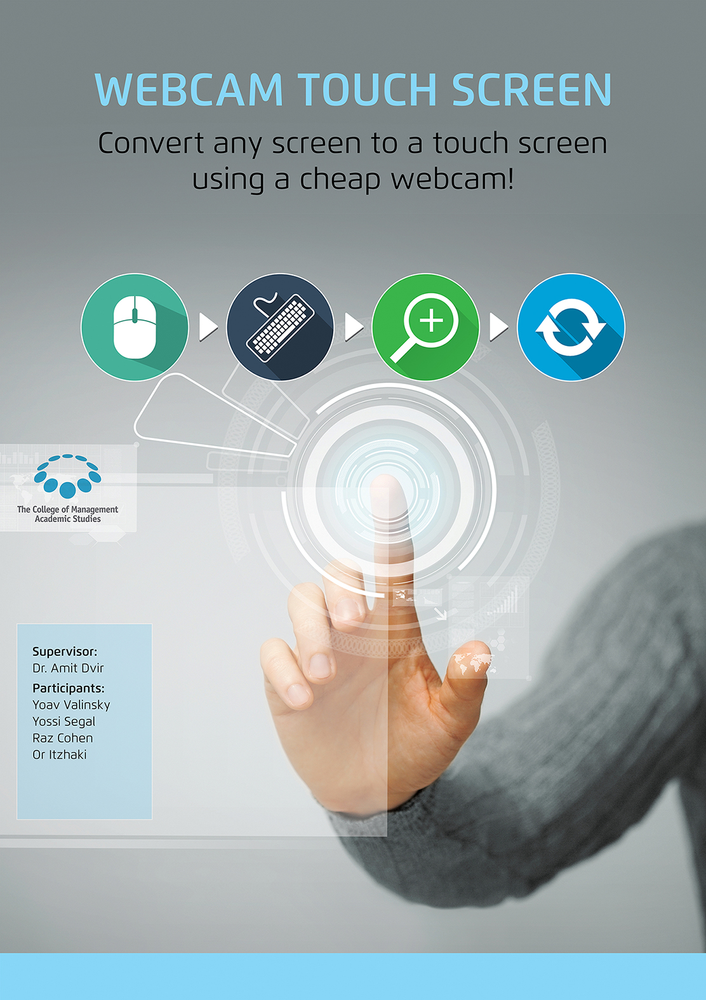

# Webcam Touch Screen
My bachelor's degree final project - converting any screen to a touch screen using a webcam

# The general idea
The goal of this project is to transform a normal screen into touch screen and replace the mouse and keyboard. This is done by using single cheap Webcam that records the monitor and detects hand motion. That motion is than transformed into an action like pressing the left mouse button or opening a keyboard.

# The solution 
## Capturing the Screen
The Webcam captures not only the screen but also parts of the environment, which are outside of it. 
The screen has four red marks in its corners and after at least three are detected a polygon of the screen borders is created and every detail outside the polygon is ignored.

## Dynamic screen location
In order to simulate a camera on a pilots helmet the system is fully capable of working while the camera is moving, as long as the screen is inside the captured image.
The system can detect the movement of the camera by comparing the previous polygon with the current one. If the difference is larger than a certain delta the screen position is readjusted.

## Locating the camera anywhere
An on the fly linear transformation is performed every time a hand gesture is recognized in order to square the quadrilateral. This is crucial since the camera is almost never perfectly aligned and thus it always records the screen as an undefined quadrilateral. Since in reality the screen is always rectangular, a linear transformation is needed to reflect the real coordinates of the hand on the screen.

## Hand detection
The hand is detected using HSV color space which fits most natural skin tones. The largest blob which is also larger than a predefined delta is than chosen. 
After the hand is chosen any holes that the blob might have due to poor light conditions are filled this is done in order to reflect the real shape of a palm.

## Fingertip detection
In order to determine the type of hand gesture the fingertips must be detected. 
This procedure includes the following steps:
Creating a line passing through the hand centroid in the general orientation of the hand.
Creating two perpendicular lines close to the edges of the object.
Intersecting those two lines with the hand, the smaller intersection is determined as the hand. The logic behind this method is that the wrist/arm will always be larger than the tip of the hand.

## Finger counting
After the location of the fingers is detected, the number of held up fingers is counted.
This is done using the same intersection method mentioned above.

## Determining the action
After we have analyzed the hand found the fingertip location and the number of fingers which are held up, we can determine the user action.
If three fingers are held up, we open/close the on screen keyboard.
If a single finger is held up, we move the mouse to the location of the fingertip.

## Last mouse locations
In order to determine if the user would like to scroll/pan/zoom we keep a queue, which saves the coordinates of the mouse in the last few frames.
If the mouse has not moved, we assume a mouse click.
If the mouse had a sharp vertical movement, we assume a scroll in that direction.
If the mouse had a sharp horizontal movement, we assume an arrow key click in that direction.
